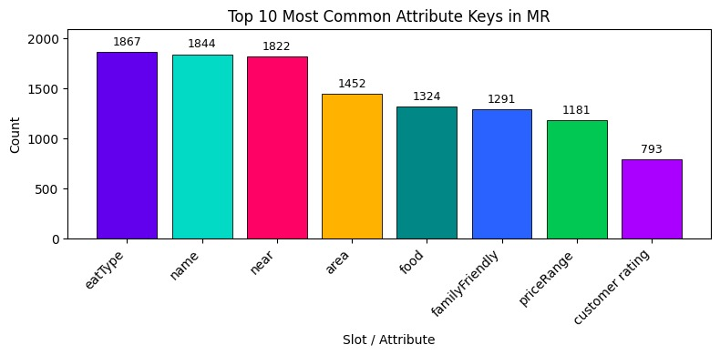

# GenAI-MR2Text: Fine-Tuned T5-small for E2E Natural Language Generation

## 📘 Abstract

This project explores transforming **structured key-value data** into **natural language sentences** using a **sequence-to-sequence (seq2seq)** transformer model. The focus is on understanding the effect of **instruction-style fine-tuning** — where explicit natural language prompts are prepended to training data — compared to standard fine-tuning.

Using the **GEM/E2E NLG dataset** and the **T5-small** model from Hugging Face, we trained two models under identical hyperparameters:

* **Baseline model:** fine-tuned on raw structured inputs.
* **Instruction-tuned model:** fine-tuned on data with added natural language instructions (e.g., *“Convert the following Key-value representation into a natural language sentence.”*).

Results show a modest but consistent improvement with instruction-tuning, including a **+0.49 increase in SacreBLEU** and a **+0.04 gain in BERTScore-F1**. Qualitative inspection confirmed that the instruction-tuned model produced more fluent and human-like sentences.
These findings suggest that even lightweight **instruction-style supervision** can enhance **model generalization and fluency** without architectural changes.

---

## 📖 Introduction

The **data-to-text generation** task involves converting structured meaning representations (slot–value pairs) into fluent natural language sentences. This is central to applications like automated reporting, dialogue systems, and summarization.

With transformer-based models such as **T5 (Text-to-Text Transfer Transformer)**, text generation tasks are unified under a single text-to-text framework, allowing one model to handle multiple NLP objectives (translation, summarization, question answering, etc.) with minimal changes.

This project investigates whether **instruction-style fine-tuning** improves the fluency and generalization of a T5-small model trained on the **E2E NLG dataset**. The two configurations were:

* **Baseline fine-tuning:** trained on raw structured slot–value pairs.
* **Instruction-based fine-tuning:** trained on inputs with added task instructions.

The hypothesis is that explicit task framing in natural language helps the model better understand the transformation objective, leading to improved generation quality and contextual accuracy.

---


## 📂 The Project notebook includes

0) Installation and imports
1) Data pre-processing
2) A quick EDA of the E2E test split
3) T5-small fine-tuning + CTranslate2 generation
4) Baseline Evaluation Without Prompt Finetuning
5) T5-small fine-tuning with adding intruct + CTranslate2 generation
6) Instruted model Evaluation With Prompt Finetuning
7) Comparative Analysis


---

## 🧰 How to Run the notebook


### 1️⃣ Clone the repository

```bash
git clone https://github.com/yourusername/t5-genai-e2e-nlg.git
```

####  Dependencies are provided in the notebook for installation

**Key dependencies:**

* `transformers`
* `datasets`
* `ctranslate2`
* `evaluate`
* `torch`
* `pandas`
* `matplotlib`
* `tqdm`

### 2️⃣ Upload the notebook (Gen_AI_Project_v5.ipynb) to the Google Colab.

### 3️⃣ Change your runtime type to T4 GPU
 
### 4️⃣ Run the code from the first cell


---

## 📊 Dataset

The **E2E NLG Challenge dataset** available at [ E2E NLG ](https://huggingface.co/datasets/GEM/e2e_nlg) consists of meaning representations (MRs) paired with human-written natural language references.

Each record includes slot-value pairs such as:

```
eatType[pub], food[Fast food], customer rating[high], area[riverside], familyFriendly[no], near[Café Rouge]
```

and its corresponding reference:

```
The Mills is not kid friendly as it is a riverside pub near Café Rouge.  Its mid priced fast food is highly rated.
```

---

## 🔍 Exploratory Data Analysis (EDA)

To understand the dataset before training, we performed:


**Example plots:**


| Metric          | Visualization                                     |
| --------------- | ------------------------------------------------- |
| Distribution of Slots per MR  |     |
| Top 10 Keys |  |

---

## ⚙️ Model Fine-Tuning

The model used was **T5-small** (~60M parameters), implemented with the **Hugging Face Transformers** library.

### Preprocessing

* **Input:** the meaning representation (MR) string (key-value pairs).
* **Output:** the target natural language sentence.
* Both were tokenized using the pre-trained **SentencePiece tokenizer** with:

  * Maximum sequence length: 512
  * Truncation and padding applied for uniformity.

This ensures that the model learns a direct mapping between structured representations and natural language outputs.


### Training Configuration

Both the **baseline** and **instruction-tuned** models were trained under identical settings:

```python
from transformers import AutoTokenizer, AutoModelForSeq2SeqLM, Seq2SeqTrainer, Seq2SeqTrainingArguments

tokenizer = AutoTokenizer.from_pretrained("google-t5/t5-small")
model = AutoModelForSeq2SeqLM.from_pretrained("google-t5/t5-small")

training_arguments = transformers.Seq2SeqTrainingArguments(
    output_dir = 't5-small-e2e_nlg',
    num_train_epochs = 3,
    eval_strategy = 'epoch',
    save_strategy='epoch',
    per_device_train_batch_size = 16,
    per_device_eval_batch_size = 16,
    save_total_limit = 3,
    load_best_model_at_end = True,
    fp16=True,
    optim='adafactor',
    report_to = []
)
```

Training used the **Hugging Face Trainer API**, which handled batching, checkpointing, and automatic restoration of the best-performing model.

Convergence was reached after **3 epochs** for both configurations. The instruction-tuned model achieved a slightly lower final training loss, suggesting more stable optimization under explicit instruction 
framing.

---

## ⚡ Inference Optimization (CTranslate2)

After training, the model was converted to **CTranslate2 format** for fast inference:

```bash
ct2-transformers-converter --model t5-small-e2e_nlg --output_dir t5-small-e2e_nlg-ct2
```

Then loaded and run as:

```python
import ctranslate2
from transformers import AutoTokenizer

translator = ctranslate2.Translator(
    't5-small-e2e_nlg-ct2',
    device='cuda',
)

tokenizer = transformers.AutoTokenizer.from_pretrained('/content/t5-small-e2e_nlg')

inputs = ["eatType[pub], food[Fast food], customer rating[high], area[riverside], familyFriendly[no], near[Café Rouge]"]

# Define function to pre process inputs
def pre_process(text):
    input_ids = tokenizer.encode(text)
    input_tokens = tokenizer.convert_ids_to_tokens(input_ids)
    return input_tokens

# Define function to post process inputs
def post_process(output):
    output_tokens = output.hypotheses[0]
    output_ids = tokenizer.convert_tokens_to_ids(output_tokens)
    output_text = tokenizer.decode(output_ids, skip_special_tokens=True)
    return output_text


# Generation function
def generation_ct2(inputs, batch_size=32, max_input_length=512, max_decoding_length=512, beam_size=1, length_penalty=1.0, repetition_penalty=1.0):

  batch = [pre_process(text) for text in tqdm(inputs)]

  all_generated = []

for i in tqdm(range(0, len(batch), batch_size)):
  subbatch = batch[i:i+batch_size]

  # translate_batch expects List[List[str]]
  results = translator.translate_batch(
          subbatch,
          max_batch_size=batch_size,
          beam_size=beam_size,
          max_input_length=max_input_length,
          max_decoding_length=max_decoding_length,
          num_hypotheses=1,
          length_penalty=length_penalty,
          repetition_penalty=repetition_penalty,
      )

  all_generated += [post_process(o) for o in results]

return all_generated

```

---

## 📊 Evaluation

Model performance was assessed using both **training/validation loss** and **external evaluation metrics**.

### 🔹 Training and Validation Loss

| Epoch | Baseline Train | Baseline Val | Instruction Train | Instruction Val |
| :---- | :------------- | :----------- | :---------------- | :-------------- |
| 1     | 0.0740         | 0.0787       | 0.0736            | 0.0782          |
| 2     | 0.0684         | 0.0740       | 0.0682            | 0.0742          |
| 3     | **0.0661**     | **0.0733**   | **0.0660**        | **0.0734**      |

Both models converged smoothly, with the instruction-tuned model showing slightly lower losses. The minimal difference in validation loss indicates comparable generalization capability.

---

### 🔹 External Metrics

| Model             | SacreBLEU ↑ | ROUGE-L ↑ | BERTScore-F1 ↑ |
| :---------------- | :---------- | :-------- | :------------- |
| Baseline          | 29.61       | **49.66** | 72.47          |
| Instruction-tuned | **30.10**   | 49.47     | **72.51**      |

The instruction-tuned model achieved:

* +0.49 increase in **SacreBLEU**
* +0.04 increase in **BERTScore-F1**
* Slight -0.19 decrease in **ROUGE-L**

These gains suggest improved **fluency and meaning preservation**, even though lexical overlap (ROUGE) slightly decreased — likely due to more natural paraphrasing.


---

## 💬 Discussion

Instruction-style fine-tuning led to small but **consistent performance gains** across metrics and qualitative assessments. The findings align with prior research on **instruction-tuned language models**, showing that providing explicit natural language context helps models interpret their tasks more effectively.

While quantitative improvements are minor, the instruction-based model generated outputs that were **more fluent, coherent, and contextually appropriate**. This indicates that **task framing** introduces an inductive bias toward better text understanding and generation — even without additional data or architectural changes.

Future work could explore:

* Scaling to larger models.
* Testing more diverse or complex instruction prompts.
* Incorporating **human evaluation** to measure perceived fluency and adequacy.

---

## Authors

- **Alireza MIRZADEH**
- **Austin TANGBAN**
- **Muhammad TAYYAB**
  
Master’s student in Natural Language Processing, Université de Lorraine

---


##  Acknowledgements

* [E2E NLG Dataset](https://huggingface.co/datasets/GEM/e2e_nlg)
* [Hugging Face Transformers](https://huggingface.co/transformers/)
* [CTranslate2](https://github.com/OpenNMT/CTranslate2)
* [Google-T5-Small](https://huggingface.co/google-t5/t5-small)

---


